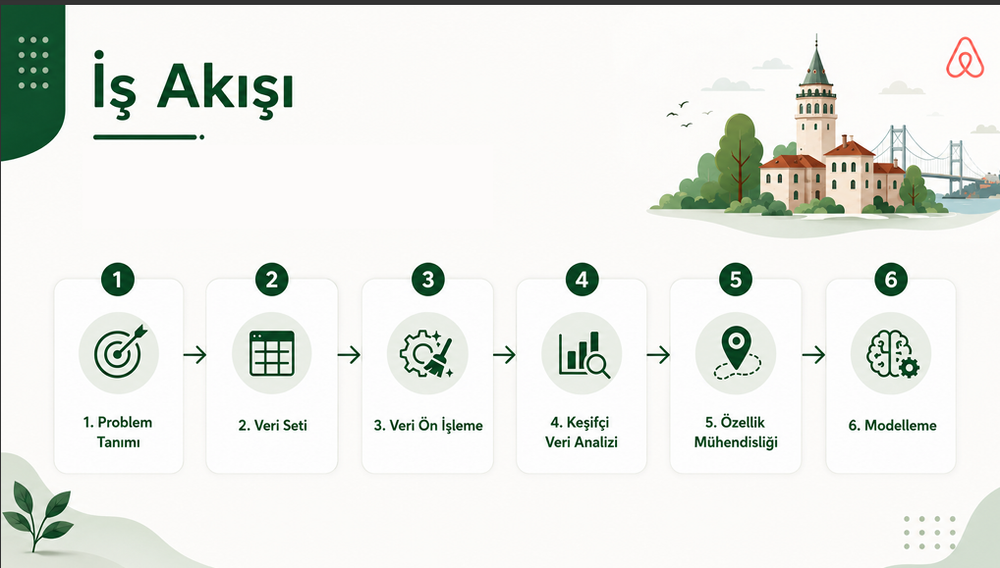
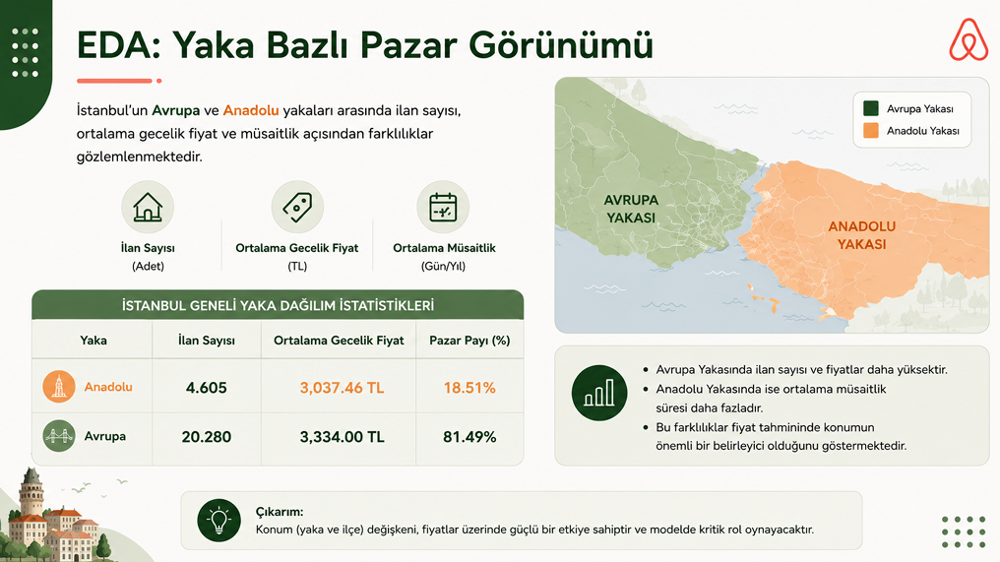
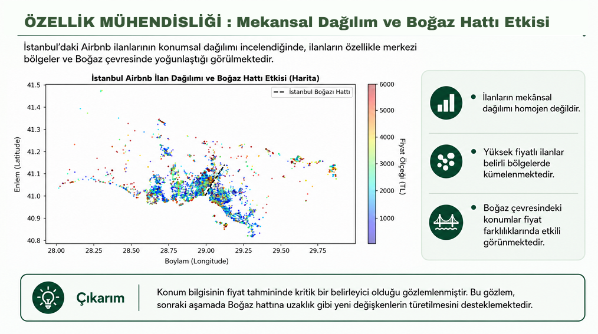
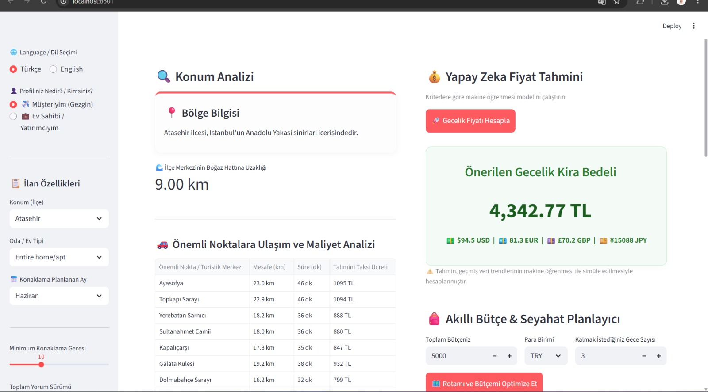
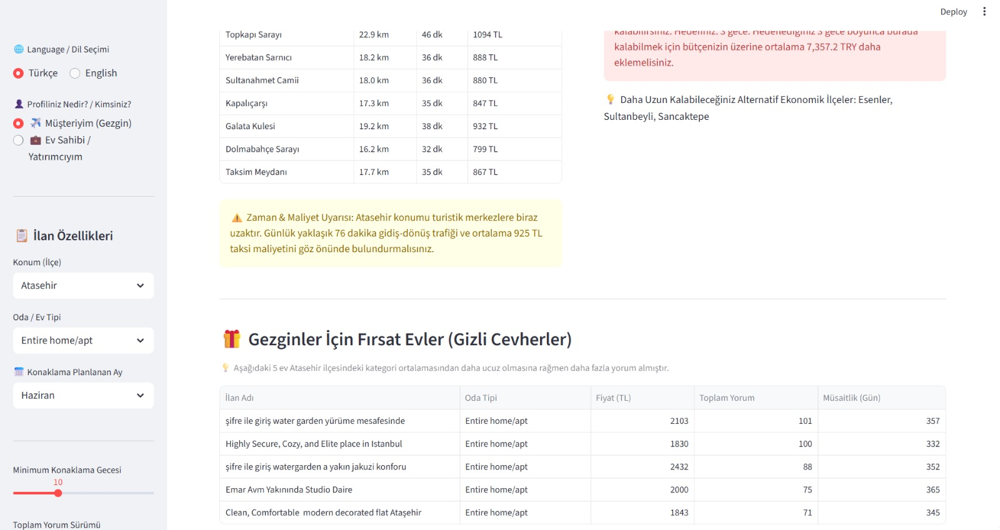
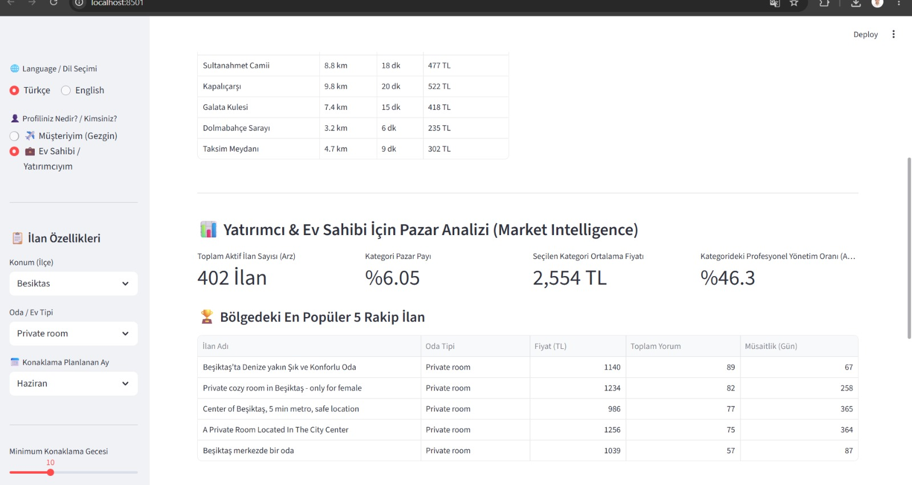

# İstanbul Airbnb Fiyat Tahmini ve Karar Destek Sistemi

## Proje Hakkında

Bu proje, İstanbul'daki Airbnb ilanlarının gecelik fiyatlarını makine öğrenmesi yöntemleri kullanarak tahmin etmek ve kullanıcıların konaklama kararlarını desteklemek amacıyla geliştirilmiştir.

Proje kapsamında Airbnb verileri analiz edilmiş, veri ön işleme ve özellik mühendisliği çalışmaları gerçekleştirilmiş, farklı makine öğrenmesi algoritmaları değerlendirilmiş ve en uygun model kullanılarak Streamlit tabanlı bir karar destek sistemi geliştirilmiştir.

---

## İş Akışı

Proje aşağıdaki aşamalardan oluşmaktadır.

1. Veri toplama
2. Veri ön işleme
3. Keşifsel veri analizi (EDA)
4. Özellik mühendisliği
5. Makine öğrenmesi modeli geliştirme
6. Model değerlendirme
7. Streamlit tabanlı karar destek sistemi geliştirme

---

## Proje Kapsamı

- Airbnb verilerinin analizi
- Veri ön işleme
- Özellik mühendisliği (Feature Engineering)
- Makine öğrenmesi ile fiyat tahmini
- Konum analizi
- Turistik noktalara uzaklık hesaplama
- Tahmini ulaşım maliyeti analizi
- Bütçe planlama
- Alternatif ilçe önerileri
- Türkçe ve İngilizce kullanıcı arayüzü

---

## Kullanılan Teknolojiler

- Python
- Streamlit
- Pandas
- NumPy
- Scikit-learn

---

## Proje Yapısı

- `main.py` → Veri ön işleme, özellik mühendisliği ve makine öğrenmesi modeli
- `app.py` → Streamlit tabanlı kullanıcı arayüzü

---

## Keşifsel Veri Analizi (EDA)

Projede İstanbul'daki Airbnb ilanları analiz edilerek fiyatları etkileyen temel faktörler incelenmiştir.

### İstanbul Airbnb Dağılımı

İstanbul genelindeki Airbnb ilanlarının coğrafi dağılımı analiz edilmiştir.

---

### Özellik Mühendisliği

Model performansını artırmak amacıyla yeni değişkenler oluşturulmuştur.

- Boğaz hattına uzaklık
- Avrupa / Anadolu Yakası bilgisi
- İlçe bazlı konum özellikleri
- Turistik noktalara erişim
- Konaklama özellikleri

---

## Makine Öğrenmesi Modeli

Airbnb gecelik fiyatlarının tahmini için makine öğrenmesi modeli geliştirilmiştir.

Model geliştirme sürecinde;

- Veri temizleme
- Özellik mühendisliği
- Model eğitimi
- Hiperparametre optimizasyonu
- Model değerlendirme

adımları uygulanmıştır.

---

## Streamlit Karar Destek Sistemi

### Konum Analizi ve Yapay Zeka ile Fiyat Tahmini

Kullanıcı seçtiği kriterlere göre gecelik fiyat tahmini alabilir. Aynı ekranda konum analizi, turistik noktalara uzaklık, tahmini ulaşım maliyeti ve bütçe planlaması sunulmaktadır.

---

### Akıllı Bütçe Planlayıcısı

Tahmin edilen fiyat doğrultusunda kullanıcının bütçesi değerlendirilir, alternatif ilçeler önerilir ve uygun Airbnb ilanları listelenir.

---

### Ev Sahibi ve Yatırımcı Paneli

Ev sahipleri ve yatırımcılar için bölgesel fiyat analizi, pazar değerlendirmesi ve karar destek araçları sunulmaktadır.

---

## Proje Çıktıları

- Airbnb gecelik fiyat tahmini
- Konum analizi
- Turistik noktalara ulaşım analizi
- Tahmini taksi maliyeti hesaplama
- Akıllı bütçe planlama
- Alternatif ilçe önerileri
- Türkçe ve İngilizce kullanıcı arayüzü

### 3. Yatırımcı & Ev Sahibi Analiz Paneli

